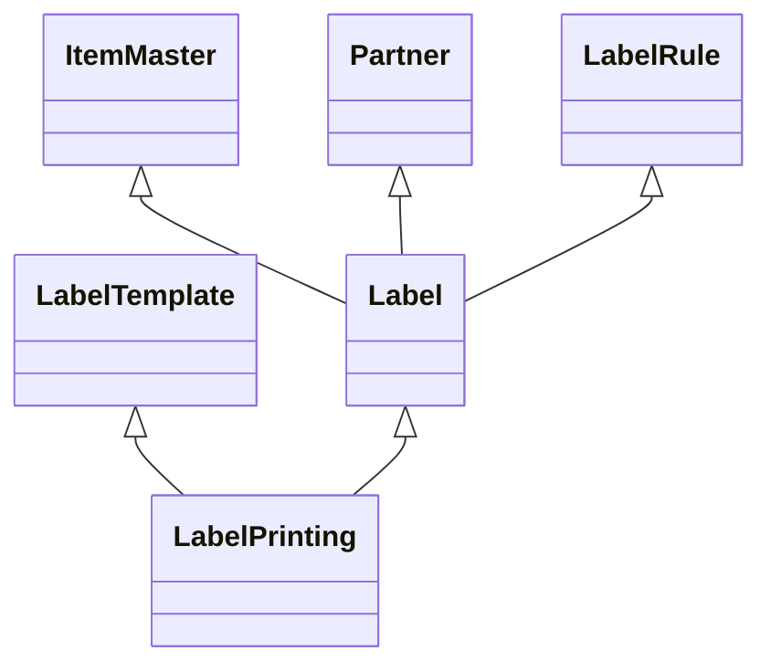

> author: Phong V Lam
> contributor(s): Phat Dang
> date: 14-Mar-2020, 16-Mar-2020, 17-Mar-2020
> since: Draft-0.1, Draft-0.2, Draft-0.3

# C-Label - Data Structure

This document is composed to take note about the data structure for the C-Label project

## Collection definition
#### Item Master
This will be the data of Item Master which migrated from **SPIDER-2**.
The structure is recommended as below:

    {
		custId,
	    partNumber,
	    description,
	    labelInformation: 
	    {
			product,
			description,
			ean ,
			sku, 
			upc, 
			coo: [ Mexico, China ],
			assembled: [ Phillipines, ThaiLand ]
		}
		obsoleted,
		deleted
    }

#### Partner
It's the same with the **Item Master**. Also it'll be migrated from the **SPIDER-2**.
The structure is recommended as below:

    {
		custId,
		company,
		deleted
	}

#### Label
It's suggested to store the information of labels and showed on the UI for users uses. And the structure recommended is:

    {
	    labelRuleId, retrieved from Label Rule collection
	    itemmasterId, => retrieved from Item Master collection
	    custId, => retrieved from Partner collection
	  *  partNumber, => data of this collection (retrieved from user input)
	  *  serialNumber, => data of this collection (retrieved from user input)
	    oemSerialNumber, => Generate by labelRuleId (Label Rule collection)
		option, => Define options based on Label rule above or anything else
	    obsoleted,
	    deleted
    }

#### Label Template
It is templates' information for the above labels. Such as Pelco 7050MF, Pelco SHB, Pelco Model, etc.
I'm not sure about the structure, but I think that it'll be:

    {
	    name,
		size, //label size
		version, //we will have multiple version for the label 
		thumbnail: {
			mimeType,
			base64,
			name
		},
		customerSettings: [
			{
				custId: PELCO, 
				partNumber: [A, B]
			},
			{
				custId: FORTINET,
				partNumber: C
			},
			{
				custId: QSC,
				partNumber: D
			}
		],
		printerSettings: 
			{
				id,
				name,
				copies, //number of copies when user print the label
				darkness,
				speed,
				teardown,
				offset: {
					x: 12,
					y: 25
				}
				autoCalibrate 
			},
		obsoleted,
		deleted
    }

#### Printer
To manage printer information, this is a structure to store it.

	{
		name,
		location,
		dpi,
		connection,
		paperSize,
		status, //ACTIVE, INACTIVE, OFFLINE, ONLINE,....
		darkness: {
			min,
			max
		},
		speed: {
			min,
			max
		}
		teardown: 40
	}

#### Label Rule
I have an idea for it. Because currently, we have been being hard-coding generating an OEM serial number for specific models.
It'll be something like this:

    {
	    name,
	    description,
	    obsoleted,
	    deleted
    }

#### Label Printing
I mean it'll be the data printed. Let's imagine it is a history of labels printed. And it should be defined as below:
When user print label -> save this data to database and sent this data to LMS
    {
	    labelId, => retrieved from Label collection
	    labelInfo, => retrieved from Label collection record of this Label
	    templateId, => retrieved from Label Template collection
	    templateInfo, => => retrieved from Label Template collection record of this Label Template
	    printerId,  => retrieved from Printer collection
		printerLocation,
		reprinted, => TRUE or FALSE
	    printedAt, => current datetime
	    printedBy, => current printed by
    }

#### API Token
I suggest a collection for calling an API from other systems. It should be called apiToken with a structure recommended:
{
	token,
	userId,
	appName, => cautom, spider, ...
	createdAt,
	expiredAt,
	deleted => TRUE or FALSE
}

## Collection diagramsou

You can render UML diagrams using [Mermaid](https://mermaidjs.github.io/).
